# 图（Graph）

## 基本概念

- 图 $G = (V, E)$ 由**顶点集** $V$ 和**边集** $E$ 组成，$(V,E)$是有序对

## 分类

| 类型 | 说明 | 示例 |
|------|------|------|
| **无向图** | 边没有方向 | 社交网络（朋友关系） |
| **有向图** | 边有方向 | 网页链接、依赖关系 |
| **带权图** | 边有权重 | 路网（距离、费用） |
| **无权图** | 边无权重 | 连通性问题 |

### properties of graph

self-loop(自环)和Multiedge(多重边)

不包含上述两个的叫简单图

Question:
在一个简单图中最大的边数是多少？

answer：n(n-1) or n(n-1) / 2

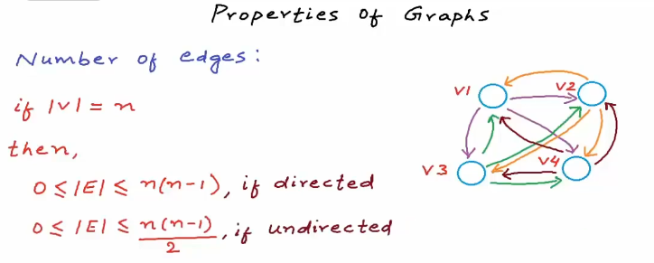

- **稠密图 vs 稀疏图**：边数接近 $|V|^2$ 为稠密，远小于为稀疏
- 一般用**邻接矩阵**来存储稠密图，用**邻接表**来存储稀疏图

### 术语

- **路径（path）**：顶点序列，相邻顶点间有边
- **度（Degree）**：度（Degree）描述的是一个顶点与其他顶点连接的边的数量。无向图中顶点的边数；有向图分**入度**（in-degree）（指向自己的）和**出度**（out-degree）（自己指出），度是入度和出度相加
- **连接性**：强连接和弱连接
- **环（Cycle）**：起点与终点相同的路径
- **连通图**：任意两点间存在路径（无向图）；**强连通图**（有向图）
- 树是一幅无环连通图。互不相连的树组成的集合称为森林。连通图的生成树是它的一幅
子图，它含有图中的所有顶点且是一棵树。图的生成树森林是它的所有连通子图的生成树的集合
- **完全图**：任意两个顶点之间都存在边

### 存储

用vector存储顶点，用二维数组(或列表)存储边（用class或struct）
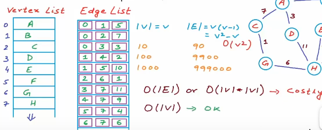

### **邻接矩阵 (Adjacency Matrix)**

```cpp
// 无权无向图示例
vector<vector<bool>> adj(n, vector<bool>(n, false));
adj[u][v] = adj[v][u] = true;
```

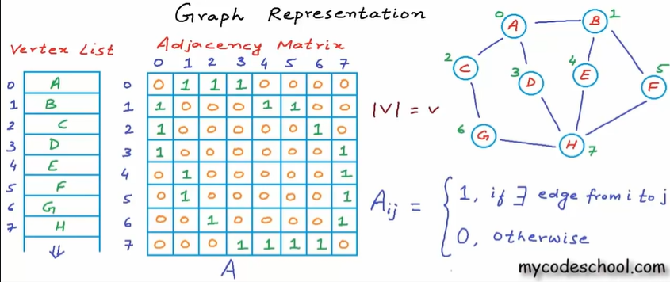
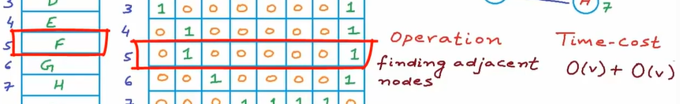


有权重：

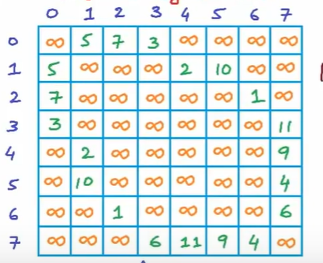

改进了时间复杂度，空间复杂度变为O(V^2),对于稀疏图会浪费很多空间内存存储0

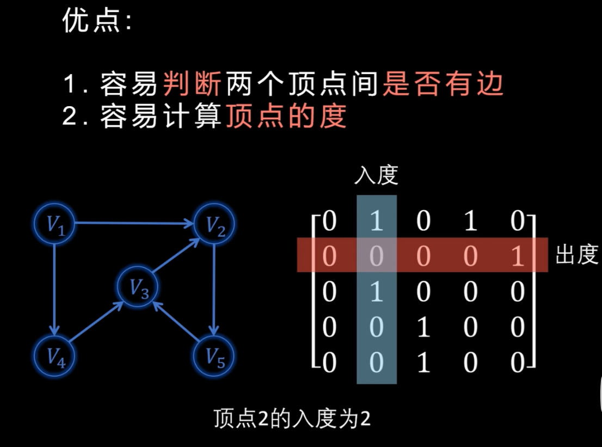

### **邻接表 (Adjacency Matrix)**

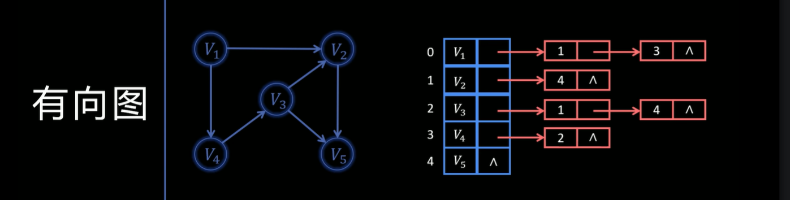

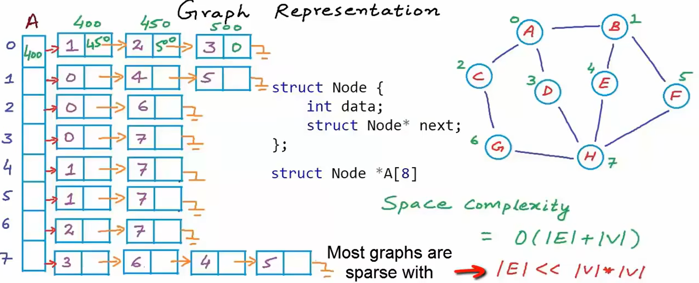
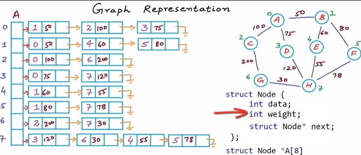

邻接表包括：顶点数组和边表节点。顶点数组中的每个元素都包含一个指向其邻接点链表的指针。边表节点则表示顶点的邻接点，包含邻接点的索引和指向下一个邻接点的指针。

空间复杂度：O(V+E)

代码实现：

1.传统实现

```cpp

// 边表节点
struct ArcNode {
int adjvex; // 邻接点索引
int weight; // 边的权重，对于无权图可以省略
ArcNode* nextarc; // 指向下一个邻接点

};
//顶点节点
struct VNode {
    int data;//顶点存储数据
    ArcNode* firstarc;//执行第一个邻接点
};
//邻接表
struct ALGraph {
    VNode vertices[max_vetex_num];//顶点数组
    int vexnum,arcnum;//顶点数和边数
};


//创建邻接表
void ALGraph(ALGraph &G){
    cin >> G.vexnum >>G.edgenum;//输入
    //c初始化顶点数组
    for (int i = 0;i < G.vexnum; ++i){
        cin >> G.vertices[i].data;
        G.vertices[i].firstarc = nullptr;    }
    //构建邻接表链表
    for (int i = 0; i<G.edgenum; ++i ){
        int start,end;
        cin >> start >> end;//有向图
        ArcNode* newNode = new ArcNode{end,nullptr};//相当于ArcNode* newNode = new ArcNode;
//newNode->adjvex = end;
//newNode->nextarc = nullptr;
        newNode->nextarc = G.vertices[start].firstarc;
        G.vertices[start].firstarc = newNode;
    }
}
```

2.**现代C++版本**

```cpp
#include <iostream>
#include <vector>
using namespace std;

int main() {
    int vexnum, edgenum;
    cout << "请输入顶点数和边数: ";
    cin >> vexnum >> edgenum;

    // 创建邻接表：adj[i] 存储顶点 i 的所有邻接点
    vector<vector<int>> adj(vexnum);  // 自动初始化为 vexnum 个空 vector

    cout << "请输入 " << edgenum << " 条边（每行: 起点 终点）:\n";
    for (int i = 0; i < edgenum; ++i) {
        int start, end;
        cin >> start >> end;

        // 检查输入合法性（可选但推荐）
        if (start < 0 || start >= vexnum || end < 0 || end >= vexnum) {
            cerr << "警告：顶点编号越界！跳过边 (" << start << ", " << end << ")\n";
            continue;
        }

        // 添加有向边：start → end
        adj[start].push_back(end);
    }

    // 输出邻接表（用于验证）
    cout << "\n邻接表如下:\n";
    for (int i = 0; i < vexnum; ++i) {
        cout << "顶点 " << i << ": ";
        for (int neighbor : adj[i]) {
            cout << neighbor << " ";
        }
        cout << "\n";
    }

    return 0;
}

//如果是带权图
// 定义：adj[u] = { {v1, w1}, {v2, w2}, ... }
vector<vector<pair<int, int>>> adj(vexnum);

// 输入边时：
int start, end, weight;
cin >> start >> end >> weight;
adj[start].push_back({end, weight});        // 有向
// adj[end].push_back({start, weight});     // 无向（取消注释）
```

## 遍历算法

从图的一个指定顶点开始到达其余顶点的方法——>遍历

1.**DFS（深度优先搜索）**：

思想：一条路走到黑，回溯，在访问其中一个顶点时：
 **将它标记为已访问； 递归地访问它的所有没有被标记过的邻居顶点**

实现：递归 或 栈

时间复杂度：O(V+E)

应用场景：
连通性检测
拓扑排序（有向无环图）
找环
岛屿问题（网格图）

步骤：

2.***广度优先搜索（BFS）**：

思想：一层一层扩展，**访问与当前节点相邻的所有节点，然后访问邻居节点的所有相邻节点**，当访问节点时：**它的邻居会被加到队列的末尾，当前节点会从队列的前端被取出**

实现：队列

时间复杂度：O(V+E)

应用场景：
最短路径（无权图）
层级遍历
洪水填充（Flood Fill）

步骤：

## 应用

### 最小生成树

最小生成树不是唯一的，当图的各边权值不相等时是唯一的，边的权值之和是唯一的，边数=顶点数-1

#### **Prim算法**

思想： 找距离点亮（被访问）的节点最近的点亮**找点**
步骤：

#### **Kruskal算法**

思想：找权值最小的边连接点亮不连通的节点**找边**

步骤：

### 最短路径

#### **Dijkstra算法**（单源最短路径）

思想：每次从未确定最短路的点中，选择当前距离最小的点 $u$，用 $u$ 更新其邻点
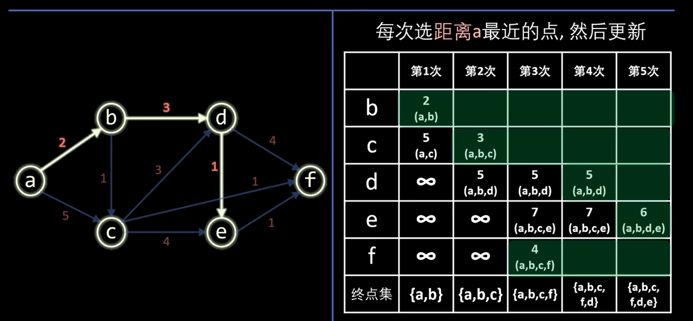

步骤：

#### **Floyd算法**

思想：不断增加中转节点（依次将每个点），每添加一个就遍历整个图所有节点，判断距离，更新（一直更新邻接矩阵）
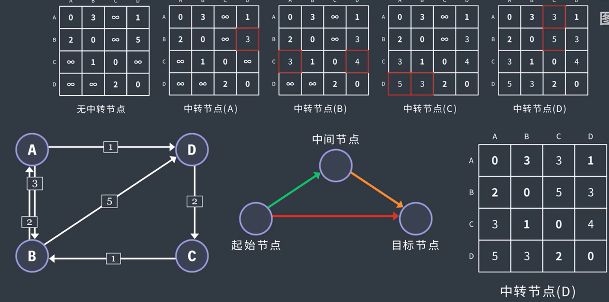

path矩阵中更新前一节点的下标
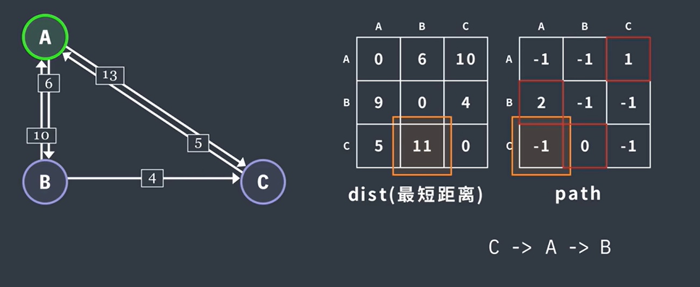

#### **拓扑排序**

可检测有向图中是否有环路（会陷入死循环）
AOV网：用顶点表示活动，有向边用来表示每个活动的先后顺序

思想：每次选入度为0的节点开始删除直到没有入度为0的节点

步骤：

#### **关键路径**

思想：拓扑求Ve（最早开始时间）,逆拓扑求Vl(最晚开始时间)

### 一些题目

无向图的所有顶点度之和=边数的2倍

推论：无向图中，度为奇数的顶点个数 必为偶数

有向图所有顶点的出度之和 = 所有顶点的入度之和 = 边数

n个顶点的连通图用邻接矩阵表示时，该矩阵至少有__2(n-1)______个非零元素

非零元素即存的是边，一个连通图边最少为n-1，无向图是对称，*2，

一个非连通无向图，共有28条边，则该图至少有__9____个顶点

n(n-1)/2=28 ——> n = 8 不连通：8+1=9

若从无向图的任意一个顶点出发进行一次深度优先搜索可以访问图中所有的顶点，则该图一定是__连通___图

___prim___算法适合构造一个稠密图的最小生成树

___拓扑排序___方法可以判断出一个有向图是否有环
